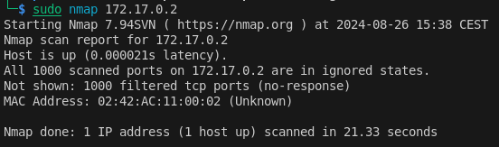
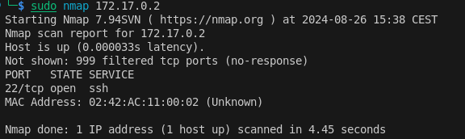

# port-knocking
Proyecto creado para ver el funcionamiento del mecanismo *port knocking*, creando una herramienta de python que lo ejecute y un contenedor de docker que lo acepte.  

# Script
Como podemos ver haciendo `sudo python3 knock.py -h`, estos son los argumentos del script:
```
usage: knock.py [-h] -i IP PORT[:PROTOCOL] [PORT[:PROTOCOL] ...]

Python script that performs port-knocking

positional arguments:
  PORT[:PROTOCOL]  Ports to use, optionally followed by ':protocol' ('tcp' or 'udp'). By default, the protocol is tcp.

options:
  -h, --help       show this help message and exit
  -i IP, --ip IP   Target IP address
```
Tiene que ejecutarse en modo administrador para que envíe los paquetes.

# Docker
Para probar el uso del script, he decidido hacer un contenedor de docker sobre el que poder hacer port-knocking. Tras recibir cierta secuencia de puertos, el contenedor permitirá el acceso por ssh.

Para construir la imagen y ejecutar el contenedor: 
```
sudo docker build -t knocking docker
sudo docker run -itd --privileged --rm --name knock knocking
```

Haciendo nmap, podemos ver que el puerto 22 no está abierto: 




Como podemos ver en el fichero [knockd.conf](docker/knockd.conf), habrá que usar la secuencia 2000:udp 3000:tcp 4000:udp para abrir el puerto 22. Para ello, ejecutaremos: 
```
sudo python3 knock.py -i 172.17.0.2 4000:udp 3000:tcp 2000:udp
```

Siendo 172.17.0.2 la IP que se asignó a mi contenedor. Para comprobarla, se puede ejecutar `sudo docker inspect bridge` y buscar el contenedor.

Como resultado, se abrirá el puerto 22 del contenedor, y se podrá acceder por ssh:


